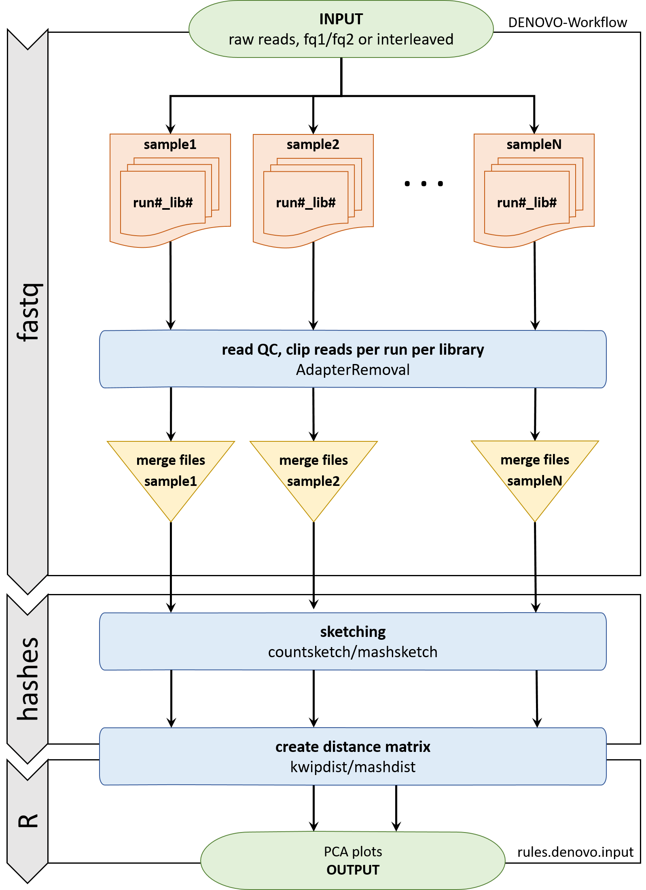
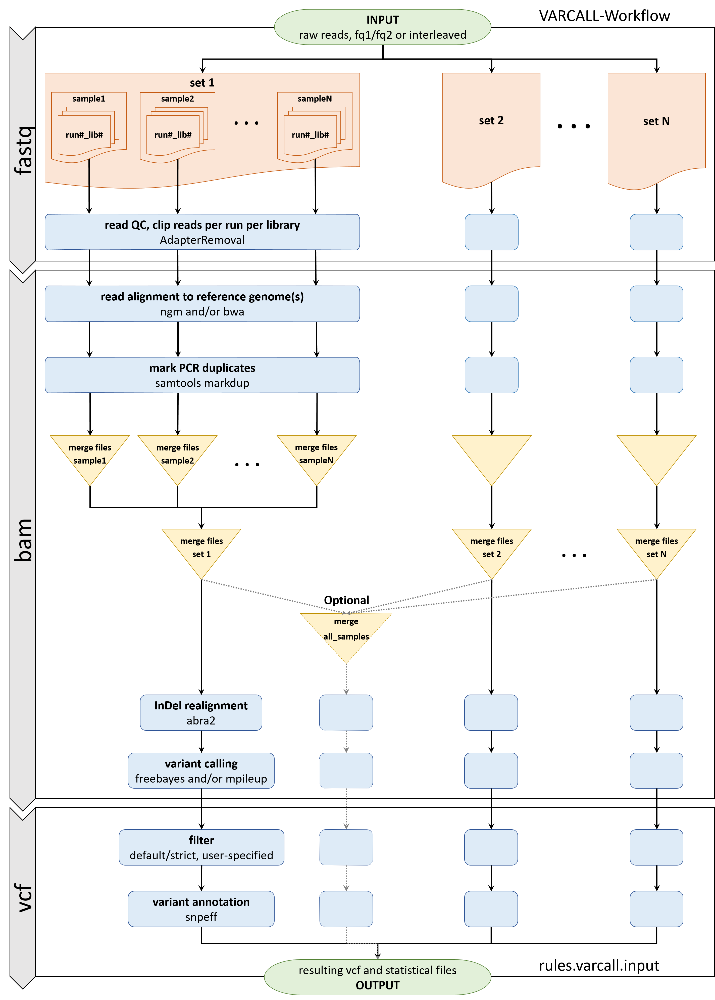

.. dna-proto-workflow documentation master file, created by
   sphinx-quickstart on Mon Nov 16 17:07:19 2020.
   You can adapt this file completely to your liking, but it should at least
   contain the root `toctree` directive.

========================================
Mutant-Analysis-workflow - Documentation
========================================

.. toctree::
   :maxdepth: 4
   :caption: Contents:

.. |br| raw:: html

   

PBGL-NGS-Analysis-workflow - Overview
--------------------------------------

This collection of Snakemake rules constitutes a workflow for the analysis of high-throughput sequencing projects. We use it mostly for genome re-sequencing data produced with Illumina-type sequencing instruments.
For this particular workflow we distinguish two different use cases: **denovo** and **varcall**. The workflow is designed to run the entire analyses automatically.

The (brief) principle of Snakemake
^^^^^^^^^^^^^^^^^^^^^^^^^^^^^^^^^^

In Snakemake, analysis workflows are defined as a series of rules. In our case, rules define the analysis steps. Each rule has input and output files. Calling a rule will invoke all necessary upstream rules. It is hence generally sufficient to request the desired output file(s) of the downstream most rule and the entire workflow will be executed.
In practice, users will provide input files, configure project meta information, adjust configuration parameters, and execute ``snakemake``. The workflow will then automatically perform all the (necessary) analysis steps to produce the defined output.

In general, a rule will be run if:

* Snakemake realizes that the expected output files of a rule are not (yet) present, or
* Snakemake realizes that the expected input files or configuration parameters of a rule have changed since the last run.

Hence, when analyses are re-run, existing and valid intermediate output files from a previous run are re-used, saving precious time and resources.
For details, please consult the `Snakemake <https://snakemake.readthedocs.io/en/stable/index.html#>`_ documentation. For the differente use cases in this workflow, invoke the rule that produces the desired output.

Mutant-Analysis-workflow Use Cases
^^^^^^^^^^^^^^^^^^^^^^^^^^^^^^^^^^

De-Novo Analysis of sample relatedness ("denovo")
~~~~~~~~~~~~~~~~~~~~~~~~~~~~~~~~~~~~~~~~~~~~~~~~~
Choosing this option will conduct a reference-free comparison of *samples* based on the raw sequencing reads using k-mers. The workflow invokes the software tools kWIP and/or mash and outputs distance matrices and PCA plots. A flowchart illustrating the summarised workflow is depicted in **Figure 1**. The workflow for this use case consists of the following steps:

+---+----------------------------+--------+------------------+
|#  |            Task            |  Rule  |    Software      |
+===+============================+========+==================+
| 1 | Prepare/clip the raw reads | readQC | AdapterRemoval   |
+---+----------------------------+--------+------------------+
| 2 | Calculate distances        | denovo | kWIP and/or mash |
+---+----------------------------+--------+------------------+
| 3 | Perform PCA and plot       | denovo | Utils/R-Scripts  |
+---+----------------------------+--------+------------------+

   Flowchart for "denovo" (click to expand)

* Invoke this option by running the rule: ``rules.denovo.input``

Required input for ``rules.denovo.input`` are fastq files and the workflow will return distance matrices between *samples* produced by kWIP and/or mash.

> NOTE: We recommend performing such denovo analysis for every project. Clustering at the level of sequencing runs can be used to confirm metadata and detect mixups.

Variant Calling - Standard Re-Sequencing Analysis ("varcall")
~~~~~~~~~~~~~~~~~~~~~~~~~~~~~~~~~~~~~~~~~~~~~~~~~~~~~~~~~~~~~
Choosing this option will run a full re-sequencing analysis ending in filtered bcf/vcf files. It detects variants and genotypes in *sets* of *samples* based on the alignments of the sequencing reads against one or several user-defined reference genome(s). Reads can be aligned with bwa and/or NextGenMap (ngm), and variants can be called with freebayes and/or mpileup. Between read alignments and variant calling, PCR duplicates are marked (with samtools markdup) and indels are realigned (using abra2). If reference genome annotation is provided, the effects of variants on gene integrity can also be predicted using the software `snpEff <https://pcingola.github.io/SnpEff/se_introduction/>`_. A flowchart illustrating the summarised workflow is depicted in **Figure 2**

The full workflow for this use case consists of the following steps:

===== ======================================= ======== ========================
 #                     Task                    Rule          Software
===== ======================================= ======== ========================
1     Prepare/clip the raw reads              readQC   AdapterRemoval
2     Align the reads to the reference genome align    bwa and/or ngm
3     Mark duplicates                         align    samtools fixmate |br|
                                                       samtools sort    |br|
                                                       samtools markdup
4     Realign indels                          align    samtools merge   |br|
                                                       abra2
5     Call variants                           varcall  freebayes and/or mpileup
6     Filter variants                         varcall  bcftools view
7     Annotate variants                       annotate snpEff
===== ======================================= ======== ========================

   Flowchart for "varcall" (click to expand)

This option can be invoked in 2 ways:

* selecting ``rules.varcall.input`` will result in one or several **vcf files**, one for each combination of sample-set, reference genome, read aligner, variant caller, and variant filter.
* selecting the rule ``rules.annotate.input`` will result in one or several **annotated vcf files** and additional summaries; running  ``rules.annotate.input`` is only meaningful when a genome annotations is available and provided in form of a snpEff database. Currently, only one reference genome annotation can be provided at a time. Hence, invoking the variant calling workflow through ``rules.annotate.input``, will restrict the  workflow upstream to only one reference genome.

Required input files are fastq files and a genome reference sequence(s) (fasta). The rule ``snpeff`` in addition depends on a genome annotation in form of a snpEff database matching the reference genome. For maximum flexibility and ease of troubleshooting we recommend to first run the re-sequencing analysis by invoking ``rules.varcall.input``, and upon successful completion invoke the workflow again, this time selecting/uncommenting ``rules.annotate.input``.

Variant Annotation - The Effects of Variants on Gene Function ("annotate")
~~~~~~~~~~~~~~~~~~~~~~~~~~~~~~~~~~~~~~~~~~~~~~~~~~~~~~~~~~~~~~~~~~~~~~~~~~
Choosing the option ``rules.annotate.input`` will annotate bcf/vcf files found in **output/variants/final/** and write annotated vcf.gz files to **output/variants_annotated/**. This analysis has only one step:

+---+-------------------+----------+----------+
| # |       Task        |  Rule    | Software |
+===+===================+==========+==========+
| 1 | Annotate variants | annotate | snpEff   |
+---+-------------------+----------+----------+

Typically, ``rules.annotate.input`` is run after a completed run of ``rules.varcall.input``. A snpEff run will complete within a matter of minutes. It will run on all files specified by entries in the ``snpeff:`` section of the ``config.yml`` file:

* ``config[snpeff:][ref:]`` one chosen reference genome,
* ``config[snpeff:][database:]`` one corresponding snpEff database,

and all combinations of specified ``samplesets``, read ``aligners``, variant ``callers``, and variant ``filter`` settings.

Hardware Requirements
^^^^^^^^^^^^^^^^^^^^^
The workflow is parallelised and Snakemake will make efficient use of available resources on local machines as well as on compute clusters. It will run faster the more resources are available, but it performs fine on smaller machines. For routine applications we have used the workflow on a budged workstation, HP Z820 with 32 cores, 64 GB RAM running Ubuntu 16.04, and on a Virtual Machine in the cloud, AZURE with 16 cores and 512 GB RAM running Ubuntu 18.04.

Snakemake allows for fine-tuning resource allocation to the individual rules, i.e., number of processors and memory. We configured each rule with reasonable defaults, but they can be tailored to your particular size project and hardware. For details please consult the `Snakemake <https://snakemake.readthedocs.io/en/stable/index.html#>`_ documentation. In general though, if limited by memory, then do not parallelise too aggressively.

Software Dependencies
^^^^^^^^^^^^^^^^^^^^^
We recommend running the workflow in its own ``conda environment`` on a Linux Server. Dependencies are listed in ``envs/condaenv.yml`` and ``envs/additional.yml``. A brief explanation how to use these files to generate the conda environment is further below. For comprehensive explanation please consult the `conda <https://docs.conda.io/projects/conda/en/latest/user-guide/getting-started.html>`_ documentation. For software that is not available through conda on some important platforms we make the specific binaries available in ``envs/``; currently mainly abra2.jar.

Workflow Use in a Nutshell - Checklist
--------------------------------------

Steps
^^^^^
1. Create a new github repository in your github account using this workflow `as a template <https://help.github.com/en/articles/creating-a-repository-from-a-template>`_
2. `Clone <https://help.github.com/en/articles/cloning-a-repository>`_ your newly created repository to your local system where you want to perform the analysis
3. Create and activate the conda environment
4. Provide reference genome(s) and annotation(s) in ``/genomes and annotation/``
5. Specify the locations of input files and their meta data in ``/metadata/sample2runlib.csv``
6. Provide lists of samples as sets to analyse in ``metadata/samplesets/``
7. List in ``metadata/contigs_of_interest`` the chromosome/contig regions for which variants should be called (bed format)
8. Uncomment the respective workflow option for your use case in the ``Snakefile``
9. Configure software parameters in ``config.yml``
10. Adapt ``snpeff.config`` (Optional in case the ``snpeff`` rule will be called)
11. Run ``snakemake``

For standard applications no additional edits are necessary. The rules reside in ``rules/*.smk``. Most rules have explicit shell commands with transparent flag settings. Expert users can change these for additional control.

12. After the successful snakemake run, `archive <https://snakemake.readthedocs.io/en/stable/snakefiles/deployment.html#sustainable-and-reproducible-archiving>`_ your workflow and the raw data to enable reproducing your work.

Workflow Use in Detail
----------------------

Creating the Virtual Environment (conda)
^^^^^^^^^^^^^^^^^^^^^^^^^^^^^^^^^^^^^^^^
We recommend running the workflow in its own conda environment on a Linux machine. The files ``envs/condaenv.yml`` and ``envs/additional.yml`` can directly be used to create the environment and install dependencies like so ("dna-proto" is an example, feel free to chose your own):

::

   $ conda create --name dna-proto
   $ conda env update --name dna-proto --file condaenv.yml
   $ conda env update --name dna-proto --file additional.yml
   $ conda activate dna-proto

If ``env update`` does not work as intended or fails, then ``conda install`` the programs manually. Specify the correct channel and software version where required. Below we give examples, but please consult the `conda <https://docs.conda.io/projects/conda/en/latest/user-guide/getting-started.html>`_ (and `bioconda <https://bioconda.github.io/>`_) documentation.

Example:

::

   $ conda install -c bioconda samtools=1.9

In case of manual installs, it is convenient to add all required channels to the ``conda config``. To install the dependencies you will need below channels.

::

   $ conda config --show channels
   channels:
         - defaults
         - bioconda
         - conda-forge
         - r
   $ conda config --add channels bioconda
   $ conda install samtools=1.9

The required channels are listed in the respective ``*.yml`` files. Configuring channels has the pitfall of rare ambiguities and collisions. Please consult the `conda <https://docs.conda.io/projects/conda/en/latest/user-guide/getting-started.html>`_ documentation for “managing channels”.

Reference Genome(s)
^^^^^^^^^^^^^^^^^^^
The workflow will look for the reference genome(s) and associated files in ``genomes_and_annotations/``. We provide an example directory tree in ``genomes_annotations/readme``. We recommend creating a separate directory for each reference genome. They can be soft links. Each reference genome directory must contain the necessary assembly file (.fa or .fna) and the associated files required by the aligners. Generate those files in this directory from the assembly file (fasta: .fa or .fna) like so:

::

   $ samtools faidx <reference-genome.fa>
   $ bwa index -a bwtsw <reference-genome.fa>
   $ ngm -r <reference-genome.fa>

# directory tree of the reference genome directory when fully prepared

::

  ~/genomes_and_annotations/
  ├── GCF_004118075.1_ASM411807v1
     ├── GCF_004118075.1_ASM411807v1_genomic.fna
     ├── GCF_004118075.1_ASM411807v1_genomic.fna.amb
     ├── GCF_004118075.1_ASM411807v1_genomic.fna.ann
     ├── GCF_004118075.1_ASM411807v1_genomic.fna.bwt
     ├── GCF_004118075.1_ASM411807v1_genomic.fna-enc.2.ngm
     ├── GCF_004118075.1_ASM411807v1_genomic.fna.fai
     ├── GCF_004118075.1_ASM411807v1_genomic.fna-ht-13-2.3.ngm
     ├── GCF_004118075.1_ASM411807v1_genomic.fna.pac
     └── GCF_004118075.1_ASM411807v1_genomic.fna.sa

Reference Genome Annotation
^^^^^^^^^^^^^^^^^^^^^^^^^^^
In order to annotate variant effects using snpEff you will need a snpEff database (``snpEffectPredictor.bin``) for the relevant reference genome. The location of the ``snpeff`` database is configured in ``snpeff.config``. It is set to ``genomes_and_annotations/snpeffdata/`` and again, we recommend separate subdirectories for the reference genomes also in this directory. Appending "_snpeff" to these directory names will help avoid confusion. In order to create a ``snpeff`` database, this ``<reference_genome>_snpeff`` directory must contain the reference genome and the annotation in files named ``sequences.fa`` and ``genes.gff``; they again can be soft links. (See ``genomes_and_annotations/snpeffdata/readme``.)

Below is an example directory tree of ``genomes_and_annotations/`` for a cowpea reference genome downloaded from NCBI. Notice that we store the reference genomes elsewhere and use soft links. Compare also to our entries in ``snpeff.config`` under “Non-standard Databases” and replicate accordingly. The database ``snpEffectPredictor.bin`` will be generated by ``snpEff build``.

::

   genomes_and_annotations/
   ├── GCF_004118075.1_ASM411807v1 -> ~/genomes/GCF_004118075.1_ASM411807v1/
   ├── readme
   └── snpeffdata
       └── GCF_004118075.1_ASM411807v1_snpeff
           ├── genes.gff -> ~/genomes/GCF_004118075.1_ASM411807v1/GCF_004118075.1_ASM411807v1_genomic.gff
           ├── genes.gtf -> ~/genomes/GCF_004118075.1_ASM411807v1/GCF_004118075.1_ASM411807v1_genomic.gtf
           ├── protein.fa -> ~/genomes/GCF_004118075.1_ASM411807v1/GCF_004118075.1_ASM411807v1_protein.faa
           ├── sequences.fa -> ~/genomes/GCF_004118075.1_ASM411807v1/GCF_004118075.1_ASM411807v1_genomic.fna
           └── snpEffectPredictor.bin

For building the database you will need to add the respective entry in ``snpeff.config`` and execute:

::

   $ snpEff build -v -c <path to snpEff.config> –gff3 <reference-genome>_snpeff

The target for snpEff build is the directory name only. The path to this directory (genomes_and_annotations/snpeffdata/) is specified in ``snpEff.config``. If executed from the top level workflow directory (the directory that contains the ``snpeff.config`` file), specifying the location of ``snpEff.config`` (-c) is not necessary.
While a ``.gtf`` file can also be used (-gtf 22), we have better experience building databases from ``.gff`` files. For a detailed explanation of the ``snpeff`` build process please consult the `snpEff <https://pcingola.github.io/SnpEff/se_introduction/>`_ documentation.

Providing Required Meta information
^^^^^^^^^^^^^^^^^^^^^^^^^^^^^^^^^^^

Samplesets
~~~~~~~~~~

We use the term *sample* as the entity of interest. Our workflows call variants on *samples* within one *set*. Lists of sample names must be provided as text files (``.txt``) in ``/metadata/samplesets/``. Each file defines a set. The ``samplesets`` in ``config.yml`` refer to those files and must match the filenames. We implemented a glob: *all_samples*, which will have the effect of concatenating all ``*.txt`` files in ``/metadata/samplesets/`` into an additional set comprising all samples across all sets. The intention is to enable easy addition or removal of samples to/from an existing analysis.

Sample Definitions
~~~~~~~~~~~~~~~~~~

In practice, the unit of interest oftentimes is the individual (plant). DNA is extracted from an individual and turned into one or several sequencing libraries that are then sequenced in one or several sequencing runs. In order to compare individuals, all respective fastq files need to be assigned to the same *sample*. For our workflow, the run - library - sample relationships need to be defined in ``/metadata/sample2runlib.csv`` making explicit which fastq files constitute the samples.
The entries in columns *run* and *library* are together used as the primary key for the **sequencing run** and thus the fastq file(s). The user must make sure that any *run* - *library* combination is unique.
**Sequencing runs** are assigned to the same *sample* through an identical entry in the *sample* column. fastq files can be provided either as separate forward and reverse read files (*fq1*, *fq2*) or as interleaved fastq (*il_fq*), with the respective other column(s) empty. Within one ``sample2runlib.csv`` file interleaved and two-file input can be mixed.

Example ``sample2runlib.csv`` file:

+------+---------+--------+----------------+----------------+----------------+
| run  | library | sample |      fq1       |     fq2        |     il_fq      |
+======+=========+========+================+================+================+
| Run1 | A-500bp | A      | <path to file> | <path to file> |                |
+------+---------+--------+----------------+----------------+----------------+
| Run1 | A-300bp | A      | <path to file> | <path to file> |                |
+------+---------+--------+----------------+----------------+----------------+
| Run2 | A-500bp | A      | <path to file> | <path to file> |                |
+------+---------+--------+----------------+----------------+----------------+
| Run2 | B-300bp | B      |                |                | <path to file> |
+------+---------+--------+----------------+----------------+----------------+
| Run1 | B-500bp | B      |                |                | <path to file> |
+------+---------+--------+----------------+----------------+----------------+
| Run1 | C-500bp | C      | <path to file> | <path to file> |                |
+------+---------+--------+----------------+----------------+----------------+

Regions of Interest for Variant Calling
~~~~~~~~~~~~~~~~~~~~~~~~~~~~~~~~~~~~~~~

Variant calling can be restricted to particular regions of interest through ``metadata/contigs_of_interest.bed``: A file in bed file format listing identifier, start-, and end-positions (tab delimited, no header) for all chromosomes/contigs for all provided reference genomes. This is helpful for exome capture data but also to restrict the analysis to specific chromosomes. In addition to the main chromosomes, genome assemblies often comprise many orphan fragments that often are not of interest or even congest the output. While the workflow will attempt to create the file if not present, we recommend to always define a ``contigs_of_interest.bed`` file. This one files serves **all** reference genomes in use and hence can/must contain **all** chromosome/contig names of interest. Obviously, it must be the exact names as in the assembly. The correct chromosome/contig names and their lengths can be conveniently extracted from the corresponding .fai file for the reference genome assemblies. Note that the analysis restriction to regions in ``metadata/contigs_of_interest.bed`` only concerns the variant calling, not the read mapping.
Below example will restrict variant calling to the 11 chromosomes of cowpea. The hundreds of additional contigs that are present in the cowpea reference genome assembly are available for read mapping, but variants will not be called for them and their variants will subsequently not be present in the bcf/vcf files. Note that lines starting with ‘#’ will be disregarded. So in this case we skip the chloroplast (NC_018051.1).

Example ``contigs_of_interest.bed`` file:

::

   NC_040279.1 0 42129361
   NC_040280.1 0 33908088
   NC_040281.1 0 65292630
   NC_040282.1 0 42731077
   NC_040283.1 0 48746289
   NC_040284.1 0 34463471
   NC_040285.1 0 40876636
   NC_040286.1 0 38363498
   NC_040287.1 0 43933251
   NC_040288.1 0 41327797
   NC_040289.1 0 41684185
   #NC_018051.1 0 152415

Workflow Configuration
^^^^^^^^^^^^^^^^^^^^^^

config.yml
~~~~~~~~~~

Central place for the user to configure the workflow behaviour and software parameters is ``config.yml``. There are comments in the file that explain the configuration parameters and options.

In Snakemake, calling a rule will trigger running of the upstream rules. When editing ``(/config.yml)`` it is important to only configure the intended most downstream rule (``varcall:``, ``annotate:``, or ``denovo:``). These settings will be propagated upstream. ``qc:`` is independent and will require editing: particularly the ``_DEFAULT_`` adaptors used. The standard adaptors for Truseq- and Nextera-Libraries are given for reference, paste under ``_DEFAULT_`` as required.

An important configuration parameter is the location of a suitable temporary directory ("tmp/"). Several rules make extensive use of the "tmp/" directory to temporarily store large files. Oftentimes, standard home directories on compute servers or cluster nodes are too small. Central place for the configuration of the "tmp/" directory is currently under the abra2 configuration options (``abra2:temp:``).

Additional Configuration
~~~~~~~~~~~~~~~~~~~~~~~~

Expert users can change the rules themselves by editing ``rules/*.rules.smk``. Use caution! We have chosen reasonable default settings and recommend modifying rules only when you know what you are doing. When allocating more cores to rules, pay attention that some rules are very memory intensive and some shell commands are piped and are in fact using more than 1 core per process.

Running the Workflow - different Workflow Use Cases
^^^^^^^^^^^^^^^^^^^^^^^^^^^^^^^^^^^^^^^^^^^^^^^^^^^

To run the workflow, un-comment the respective rule for the desired use case in the ``Snakefile`` and run snakemake.

::

   $ snakemake –npr
   $ snakemake –j 6 --notemp -kpr

For details on commandline options for snakemake please consult the `Snakemake <https://snakemake.readthedocs.io/en/stable/index.html#>`_ documentation. Un-comment only the one most downstream rule for your use case. Currently, these use case rules are:

::

   # USER OPTIONS
   #     rules.denovo.input,
   #     rules.varcall.input,
   #     rules.annotate.input,

A rule that encounters missing input files will invoke the respective upstream rule(s). E.g., when ``rules.annotate.input`` is uncommented and snakemake is run for the first time, the entire workflow from ``readqc`` (= adapter and quality clipping), ``align`` (= read alignments, duplicate marking, indel realignment), ``varcall`` (= variant calling), and ``annotate`` (= variant functional annotation) will run in one go.
In case no ``snpeff`` database is supplied, then rule ``rules.annotate.input`` cannot be run. Use ``rules.varcall.input`` instead.

When configuring ``config.yml``, keep in mind that configuration parameters of a downstream rule take precedence because parameters have to propagate upstream. I.e., When running ``varcall``, the user must set alignment parameters in the ``varcall:`` section; same for ``annotate:`` parameters. They must be set under ``snpeff:``.

>NOTE: Adjusting presumed upstream parameters, e.g., under ``align:`` will not have the intended effect. Only in special circumstances will the ``rules.align.input`` be run by itself and only then will you have to adjust parameters in the ``align:`` section.

The workflow runs on *samples* in *sets* as listed in ``samplesets/*.txt`` and defined in ``/metadata/sample2runlib.csv``. Sample names listed in ``samplesets/*.txt`` must correspond to the entries in the sample column in ``/metadata/sample2runlib.csv``.

De-Novo Analysis of sample relatedness ("denovo")
~~~~~~~~~~~~~~~~~~~~~~~~~~~~~~~~~~~~~~~~~~~~~~~~~

Option **denovo** can be used to check the relatedness of *sequencing runs* and/or *samples* without the use of any reference genome. It will perform a comparative analysis based on k-mers on the raw data and output distance matrices. We recommend performing a de-novo analysis at the very start of every project at the “sequencing run”-level prior to any merging of runs into samples. This can help to detect mix-ups and mislabels. Run-level clustering is achieved by providing unique names for each sequencing run in the sample column of ``metadata/sample2runlib.csv``. De-novo analysis is invoked by calling ``rules.denovo.input`` (Uncomment the respective line in the ``Snakefile``, and only this line). Pay attention to maintain the indentation.

::

   rule all:
       input:
   # USER OPTIONS
               rules.denovo.input,
   #            rules.varcall.input,
   #            rules.annotate.input,
   # EXPERT OPTIONS
   #            rules.readqc.input,
   #            rules.align.input,
   #            rules.stats.input,

Variant Calling - Standard Re-Sequencing Analysis ("varcall")
~~~~~~~~~~~~~~~~~~~~~~~~~~~~~~~~~~~~~~~~~~~~~~~~~~~~~~~~~~~~~

Running ``rules.varcall.input`` will call variants and genotype *samples* with respect to one or several reference genomes. **varcall** will compare *samples* listed in ``metadata/samplesets/`` with one another, as defined in the sample column. Invoke this analysis by uncommenting ``rules.varcall.input`` (and only this line). Pay attention to maintain the indentation.

::

   rule all:
       input:
   # USER OPTIONS
   #        rules.denovo.input,
           rules.varcall.input,
   #        rules.annotate.input,
   # EXPERT OPTIONS
   #        rules.readqc.input,
   #        rules.align.input,
   #        rules.stats.input,

Variant Annotation - The Effects of Variants on Gene Function ("annotate")
~~~~~~~~~~~~~~~~~~~~~~~~~~~~~~~~~~~~~~~~~~~~~~~~~~~~~~~~~~~~~~~~~~~~~~~~~~

If a snpEff library for this (exact) reference genome is provided then the entire workflow can in principle be invoke by uncommenting ``rules.annotate.input`` (and only this line). Pay attention to maintain the correct indentation.

::

   rule all:
       input:
   # USER OPTIONS
   #       rules.denovo.input,
   #       rules.varcall.input,
          rules.annotate.input,
   # EXPERT OPTIONS
   #       rules.readqc.input,
   #       rules.align.input,
   #       rules.stats.input,

Currently, ``rules.annotate.input`` will operate only on one reference genome at a time. The rule will hence propagate upstream only one reference genome as requirement. If variants detected against several different reference genomes need annotating, then first run the ``varcall`` rule specifying all reference genomes and subsequently invoke the ``annotate`` rule separately for each reference genome annotation.

Expert Options
~~~~~~~~~~~~~~

In cases where only adapter clipping or read alignment is desired, those processes can be invoked separately by the respective rules,  ``rules.readqc.input`` or ``rules.align.input``. There are separate configurations sections for those in ``config.yml`` which must be used. Alignment will trigger prior adaptor clipping.
Invoking ``rules.stats.input`` will produce summary statistics. They will require read alignments and are meaningful for generic **varcall** runs.

Workflow Outputs
----------------

After completion, all output of the workflow, including logs and stats, will be in ``output/``.

* Clipped reads (in interleaved fastq format) are in ``output/reads/``
* BAM files with In/Del-realigned alignments are in ``output/abra/``
* BCF/VCF files of the filtered variants including respective index files are in ``output/variants/final/``
* The snpEff-annotated variant file is in ``output/annotated_variants/snpeff/``

VCF files in ``output/variants/final/`` have been filtered with *bcftools view* according to the user defined filter settings in ``config.yml``.
For loading into IGV, use the In/Del realigned BAM file in ``output/abra/`` and the ``*.vcf.gz`` files of the filtered variants. Note that IGV requires the ``vcf.gz.tbi`` index.

Support
-------
..
  License (this block is currently commented out (by indentation))
  ^^^^^^^

  Mutant-Analysis-workflow is copyright Norman Warthmann and released under the GNU General Public License version 3 (or any later version).

Contributors
^^^^^^^^^^^^

This workflow was developed by Norman Warthmann of the Plant Breeding and Genetics Laboratory of the FAO/IAEA Joint Division (PBGL), with important contributions from Kevin D Murray (Australian National University) and Marcos Conde, PBGL. The documentation was written by Norman Warthmann with contributions from Anibal Morales, PBGL.

..
  Citing
  ^^^^^^

  When publishing results obtained using this workflow please cite the link to the original github repository specifying the release.

Reproducibility
^^^^^^^^^^^^^^^

Workflows help addressing the reproducibility issue. Consider making your version of the workflow, configured for your data, available upon publication of your results. Check out the `archive <https://snakemake.readthedocs.io/en/stable/snakefiles/deployment.html#sustainable-and-reproducible-archiving>`_ options of Snakemake.

..
  Disclaimer
  ^^^^^^^^^^

Getting Help
^^^^^^^^^^^^

Feel free to let us know if you are using our workflow and don’t hesitate to contact us with questions: email **n.warthmann@iaea.org**
